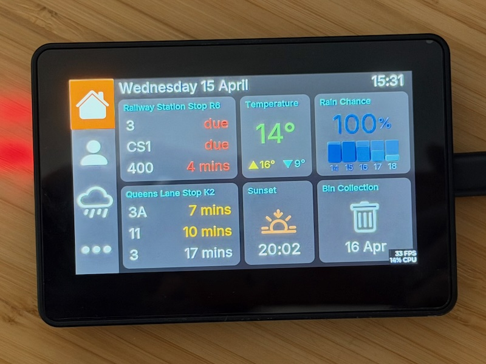
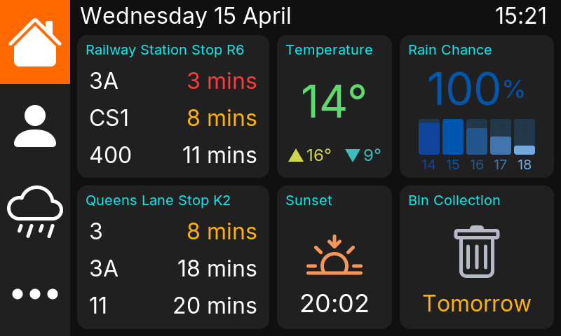

# waveshare-home-dashboard

This is a home dashboard running on a [Waveshare ESP32-S3-Touch-LCD-4.3B][waveshare] 4.3" touchscreen display. It shows live bus times, weather forecasts, bin collection dates and other data.





## Table of Contents

- [Directory Layout](#directory-layout)
- [Hardware](#hardware)
- [Architecture](#architecture)
- [Server](#server)
- [MQTT](#mqtt)
- [Client](#client)
  - [LVGL](#lvgl)
  - [EEZ Studio and EEZ Flow](#eez-studio-and-eez-flow)
  - [Fonts](#fonts)
  - [Images](#images)
  - [HTTP Server](#http-server)
- [OTA Firmware Updates](#ota-firmware-updates)
- [Development Flow](#development-flow)
- [Configuration](#configuration)

## Directory Layout

```
waveshare-home-dashboard
├── eez-studio             - EEZ Studio files
│   └── src                - generated source
├── esp-idf                - ESP-IDF source
│   ├── components         - custom components
│   ├── main               - main loop
│   ├── setup              - file used to initialise repository
│   └── test               - tests
├── images                 - source images and build script
└── server                 - Python server
```

## Hardware

The hardware was chosen because it was an ESP32 system with an LCD touchscreen
that was reasonably cheap and available with a case instead of as a bare board.
It was bought as a device to experiment with rather than with any specific use
case mind.

## Architecture

The implementation consists of a server component which collects data and
publishes it via MQTT.  The ESP32 device subscribes to the MQTT topics and
displays the data.

```
┌───────────┐
│  Pirate   │
│  Weather  │◀─────┐                                                      ┌─────────────────────────────────┐
│    API    │      │                                                      │     Waveshare ESP32 System      │
└───────────┘      │                                 ┌──────────┐         │                                 │
┌───────────┐      │       ┌───────────────┐         │   MQTT   │         │ ┌──────────┐       ┌──────────┐ │
│ Recycling │      │       │    Python     │────────▶│  Broker  │─────────┼▶│  ESP-IDF │       │ EEZ Flow │ │
│   iCal    │◀─────┼───────│    Server     │         └──────────┘         │ │  C Code  │──────▶│    UI    │ │
└───────────┘      │       │   (Docker)    │◀────────────HTTP─────────────┼─│          │       └──────────┘ │
                   │       └───────────────┘                              │ └──────────┘                    │
┌───────────┐      │                                                      └─────────────────────────────────┘
│    Bus    │      │
│   Times   │◀─────┘
└───────────┘
```

The benefits of having a server over having the clients poll the data sources directly are:

* If we have multiple devices we do not put extra load on API limits.
* We can use a plain HTTP for OTA updates as they're only served on the local network so we have fewer security concerns.

## Server

The Python server is a lightweight data aggregator written in Python 3.14, managed with [uv] and packaged as a [Docker][docker] image for deployment. Its runtime dependencies are minimal: `paho-mqtt` for broker communication, `requests` for HTTP calls to external APIs, `schedule` for periodic refresh, `icalendar` and `recurring-ical-events` for parsing recycling calendars, and `python-dateutil` for date arithmetic.

Each data source (bus times, weather, recycling, presence) is implemented as a `DataSource` subclass with three responsibilities: fetching raw data from its upstream API, formatting it into the JSON structure the device expects, and declaring how often it should refresh. On startup every source fetches immediately and then the schedule library fires subsequent updates on a background thread — every minute for buses and presence, every 15 minutes for weather, and once daily at midnight for recycling.  Fetched data is cached in memory so that re-publishing on reconnect doesn't require a fresh API call.

The aim is for data to be send from the server as generically as possible, with specific formatting - e.g. for dates and times - being done in the C code before passing to EEZ Flow.

The server also runs a small `ThreadingHTTPServer` that handles the OTA firmware update workflow.  This is detailed below.

Configuration is accepted via command-line flags or environment variables (the Docker path), with a consistent priority order: command line flags, then environment variables and finally defaults.

## MQTT

All data is delivered to the device as JSON payloads over MQTT. Topics are published with `retain=True` so a device that connects mid-cycle receives the latest values immediately without waiting for the next refresh. The server maintains a persistent async connection and skips publishes when the payload hasn't changed since the last send.

An MQTT Last Will and Testament is registered at startup so the broker automatically delivers `{"connected": false}` to `dashboard/server` if the process exits uncleanly — the client uses this to determine if the server is disconnected, which would mean that the persisted data is stale.

The topic prefix is configurable.  This is to allow a development server and a production server to share the same MQTT broker.  The prefix defaults to `dashboard` and is set via Kconfig (`CONFIG_MQTT_TOPIC_PREFIX`) for the client and `MQTT_TOPIC_PREFIX` or `--mqtt-topic-prefix` on the server.

The topics are as follows:

| Topic | Payload |
|-------|---------|
| `dashboard/bus_stops` | Bus arrival data |
| `dashboard/weather` | Weather forecasts |
| `dashboard/recycling` | Bin collection dates |
| `dashboard/presence` | Array of people and whether they're home based on their MAC address being connected to the network|
| `dashboard/ota` | Firmware update information |
| `dashboard/server` | Server heartbeat |


## Client

The device is a pure subscriber and renderer — it holds no API keys and makes no external HTTP requests for data. The backend server owns all the data-fetching logic and publishes structured JSON to well-defined topics.

The client uses the [ESP-IDF development platform][espidf].  There is no Arduino or PlatformIO.  As the project targets a single device there is less value in PlatformIO, and ESP-IDF gives better performance than Arduino, which helps with the [common issues around screen drift][drift].

### LVGL

The client uses [LVGL][lvgl] 8.4 for graphics.  The code leans heavily on the LVGL example code.  Changes from this are documented in `esp-idf/components/LVGL/README.md`.

LVGL is configured to avoid the screen tearing and drift issues seen on ESP32.  This is done with two full height buffers in PSRAM and `LVGL_PORT_AVOID_TEARING_MODE` set to 3.

The LVGL port runs its own FreeRTOS task pinned to Core 1, leaving Core 0 free for WiFi, MQTT, and the main loop.  This is why UI updates are gated with calls to `lvgl_port_lock`.

### EEZ Studio and EEZ Flow

The UI is designed visually in [EEZ Studio][eezstudio] and exported as C/LVGL code.  The UI is designed visually in [EEZ Studio](https://www.envox.eu/eez-studio/) and exported as C/LVGL code.  EEZ Studio was chosen over [Squareline Studio][squareline] as the free licence offers full functionality.

The generated files live in `components/ui/` and should not be edited by hand.  The `copy-ui.sh` script, executes EEZ Studio to regenerate the UI files and copies them to `components/ui/`.  It is run on each build.

The current version of the EEZ Framework isn't available in the [ESP Component Registry][registry].  The `setup.sh` script clones the GitHub respository into the `components/eez-framework` directory.

EEZ Flow is used for UI logic only.  As much as possible is done in the C code rather than with the flows in EEZ Studio.  Data is primarily sent using EEZ Flow Global Variables.

### Fonts

Font are compiled directly into the firmware as C arrays by EEZ Studio.  The fonts used are:

* [Inter][inter]
* [Roboto Condensed][roboto-condensed]

### Images

Images are are compiled directly into the firmware as C arrays created by EEZ Studio.  Source images are SVGs downloaded from the [Pictogrammers Material Design Icons Library][material] and the [Bootstrap Icon Library][bootstrap].  The `images/convert_icons.py` script converts these to PNG files to import in to EEZ Studio.

### HTTP Server

The device runs a lightweight HTTP server on port 80, providing a browser-based interface for diagnostics.  It was primarily built as a way to get screenshots without having to write files to flash, but it also offers some diagnostic endpoints.

| Path | Description |
|------|-------------|
| `/` | Index page |
| `/system` | System information |
| `/log` | Log viewer |
| `/screenshot` | Screenshot as a BMP image |

## OTA Firmware Updates

The devices use the standard ESP method for firmware updates: two partitions, switching between them with each update.  The firmware images are downloaded from the local server.

The flow is as follows:

1. A new firmware image is uploaded to the server via a `POST` to `/ota/firmware`.  This is usually done with the `release.sh` script.
2. The server saves the image to the directory specified by `OTA_FIRMWARE_DIR`.
3. The server publishes the new version and a download URL to the `dashboard/ota` MQTT topic.
4. The client checks the version against it's current version.  If the version is different,  it downloads the new version, writing it to the partition it did not boot from, and then reboots.


## Development Flow

The project uses layered `sdkconfig` files so development and production builds can differ without touching shared config.

| File | Committed | Purpose |
| ---- | --------- | ------- |
| `sdkconfig.defaults` | Yes | Shared base — hardware settings, PSRAM, partition table |
| `sdkconfig.release` | Yes | Release overrides — optimisation, log level, no perf overlay |
| `sdkconfig.local` | No | Per-device secrets — WiFi credentials, MQTT prefix |
| `sdkconfig.release_local` | No | Per-device release overrides if needed |

Dev builds load `sdkconfig.defaults` and `sdkconfig.local`. Release builds layer all four.

The differences with development build are:

* Log level is `INFO` rather than `WARN`.
* A different MQTT topic prefix is used.
* The  LVGL Performance Overlay is enabled.
* Fewer compiler optimisations.

### Development scipts

| Script | Description |
| ------ | ----------- |
| `setup.sh` | One-time setup — clones `eez-framework` into `components/` and installs the custom `CMakeLists.txt` |
| `start.sh` | Sourced by other scripts — sources the ESP-IDF environment, sets `TZ`, and exports `SDKCONFIG_DEFAULTS` and `BUILD_DIR` for dev builds |
| `build.sh` | Builds the firmware (`idf.py build`) using the dev config |
| `flash-monitor.sh` | Flashes the app partition and opens the serial monitor (`idf.py app-flash monitor`) |
| `monitor.sh` | Opens the serial monitor without flashing (`idf.py monitor`) |
| `release.sh` | Builds a release firmware with a timestamp version, flashes it, saves a versioned `.bin` to `../firmware/`, and uploads it to the OTA server |


## Configuration

### Server

The server configuration values are as follows:

| Setting | Environment Variable | CLI Flag | Description | Required | Default |
|---------|---------------------|----------|-------------|----------|---------|
| Port | `DASHBOARD_PORT` | `-p`<br>`--port` | Port the HTTP server listens on | No | `8000` |
| Bus stop IDs | `BUS_STOP_IDS` | `-b`<br>`--bus-stop-id` | Comma-separated stop IDs (env) or repeatable flag | Yes | — |
| Bus stop names | `BUS_STOP_NAMES` | — | Comma-separated `id=name` overrides for stop display names | No | — |
| Latitude/longitude | `LAT_LONG` | `-l`<br>`--lat-long` | Coordinates for weather lookups, e.g. `51.75,-1.25` | Yes | — |
| Pirate Weather API key | `PIRATE_API_KEY` | `-k`<br>`--pirate-api-key` | API key for the Pirate Weather service | Yes | — |
| Recycling calendar URL | `RECYCLING_CALENDAR_URL` | `-r`<br>`--recycling-calendar-url` | iCal URL for bin collection dates | Yes | — |
| UniFi controller URL | `UNIFI_URL` | `--unifi-url` | Base URL of the UniFi controller, e.g. `https://192.168.1.1` | Yes | — |
| UniFi API key | `UNIFI_API_KEY` | `--unifi-api-key` | UniFi Network API key (use this **or** username/password) | No | — |
| UniFi username | `UNIFI_USERNAME` | `--unifi-username` | UniFi controller username (use this **or** API key) | No | — |
| UniFi password | `UNIFI_PASSWORD` | `--unifi-password` | UniFi controller password (use this **or** API key) | No | — |
| UniFi clients | `UNIFI_CLIENT_NAMES` | `--unifi-client` | Comma-separated `mac=name` pairs of devices to track (repeatable flag) | No | — |
| MQTT broker host | `MQTT_BROKER_HOST` | `--mqtt-broker-host` | Hostname of the MQTT broker | No | `mosquitto.home.arpa` |
| MQTT broker port | `MQTT_BROKER_PORT` | `--mqtt-broker-port` | Port of the MQTT broker | No | `1883` |
| MQTT topic prefix | `MQTT_TOPIC_PREFIX` | `--mqtt-topic-prefix` | Topic prefix for all published messages | No | `dashboard` |
| Server base URL | `SERVER_BASE_URL` | `--server-base-url` | Publicly accessible base URL of this server, included in OTA MQTT messages | No | `http://dashboard.home.arpa` |
| Log level | `LOG_LEVEL` | — | Logging verbosity (`DEBUG`, `INFO`, `WARNING`, `ERROR`) | No | `INFO` |
| OTA firmware directory | `OTA_FIRMWARE_DIR` | — | Directory where uploaded firmware binaries are stored | No | `/tmp/ota` |

### Client

The client Kconfig options are as follows:

| Component | Option | Type | Default | Description |
|-----------|--------|------|---------|-------------|
| WiFi | `CONFIG_WIFI_SSID` | string | `""` | Network name to connect to. Set in `sdkconfig.defaults.local`. |
| WiFi | `CONFIG_WIFI_PASSWORD` | string | `""` | WiFi password. Leave empty for open networks. |
| WiFi | `CONFIG_WIFI_USE_STATIC_IP` | bool | `n` | Assign a fixed IP instead of using DHCP. |
| WiFi | `CONFIG_WIFI_IP_ADDRESS` | string | `""` | Static IP address. Requires `WIFI_USE_STATIC_IP`. |
| WiFi | `CONFIG_WIFI_GATEWAY` | string | `""` | Gateway address. Requires `WIFI_USE_STATIC_IP`. |
| WiFi | `CONFIG_WIFI_SUBNET` | string | `255.255.255.0` | Subnet mask. Requires `WIFI_USE_STATIC_IP`. |
| WiFi | `CONFIG_WIFI_DNS1` | string | `8.8.8.8` | Primary DNS. Requires `WIFI_USE_STATIC_IP`. |
| WiFi | `CONFIG_WIFI_DNS2` | string | `8.8.4.4` | Secondary DNS. Requires `WIFI_USE_STATIC_IP`. |
| MQTT | `CONFIG_MQTT_BROKER_URL` | string | `mqtt://mosquitto.home.arpa` | URI of the MQTT broker. |
| MQTT | `CONFIG_MQTT_TOPIC_PREFIX` | string | `dashboard` | Topic prefix for all subscribed topics, e.g. `dashboard/weather`. Change per device to isolate dev/prod. |
| Clock | `CONFIG_CLOCK_POSIX_TZ` | string | `UTC0` | POSIX TZ string for the local timezone, e.g. `GMT0BST,M3.5.0/1,M10.5.0` for UK. |
| Clock | `CONFIG_CLOCK_NTP_SERVER` | string | `uk.pool.ntp.org` | NTP server hostname for time sync. |


[waveshare]: https://www.waveshare.com/wiki/ESP32-S3-Touch-LCD-4.3B
[uv]: https://docs.astral.sh/uv/
[docker]: https://docs.docker.com/
[espidf]: https://idf.espressif.com/
[drift]: https://docs.espressif.com/projects/esp-faq/en/latest/software-framework/peripherals/lcd.html#why-do-i-get-drift-overall-drift-of-the-display-when-esp32-s3-is-driving-an-rgb-lcd-screen
[eezstudio]: https://www.envox.eu/eez-studio/
[squareline]: https://squareline.io
[lvgl]: https://lvgl.io
[registry]: https://components.espressif.com/
[material]: https://pictogrammers.com/library/mdi/
[bootstrap]: https://icons.getbootstrap.com/
[inter]: https://fonts.google.com/specimen/Inter
[roboto-condensed]: https://fonts.google.com/specimen/Roboto+Condensed